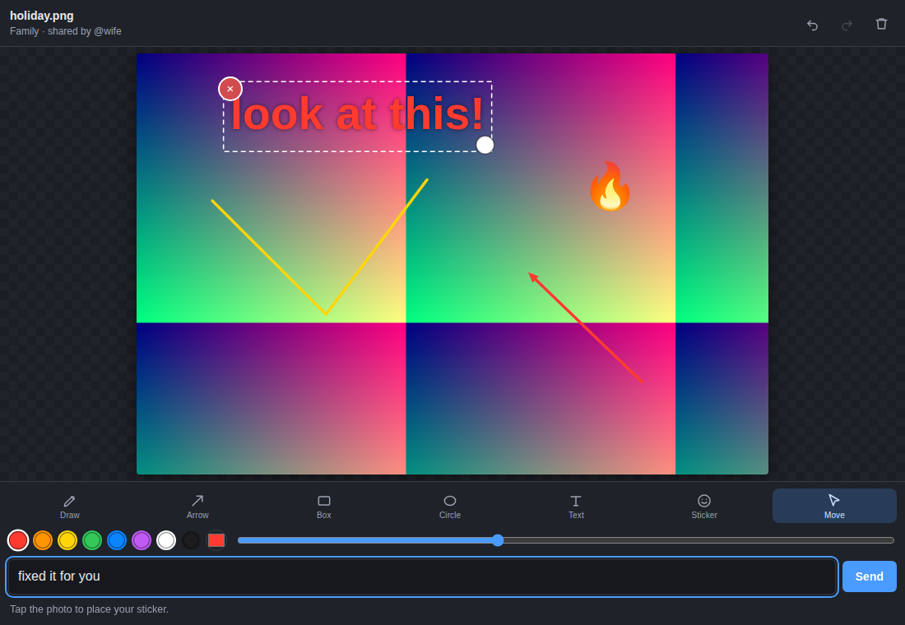
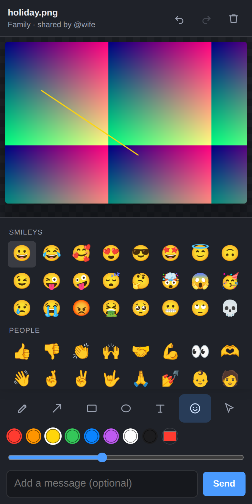

# Mattermost Paint

Annotate photos inside Mattermost and send the edited copy straight back into the
thread — the thing Facebook Messenger does when you tap the pencil on a picture
someone sent you.

Draw on it, point at something with an arrow, add a caption, slap a 🔥 on it,
press **Send**. The original stays untouched; your version is posted as a reply.

Works on **Mattermost Team Edition**. Plugins are not an Enterprise feature.



## How you use it

### Web and desktop apps

Two ways in, both on any image in any channel you can post to:

* Open the photo and press **Edit** on the preview.
* Or use **Annotate image** in the attachment's `···` menu.

### iOS and Android apps

Here is the honest limitation, and it is worth understanding before you install:
**the official Mattermost mobile apps cannot render plugin interfaces at all.**
That part of the app is native and closed to plugins, so no plugin can put a
pencil icon there. This is a limit of Mattermost, not something a better plugin
would solve.

So mobile gets a different door into the same editor:

```
/paint      → edit the most recent image in this channel
/paint 3    → edit the third most recent image
/paint help
```

You get a private, expiring link back that only you can see and only you can
open. Tapping it opens the full editor in the phone's browser, already loaded
with the photo. Draw, press Send, and the reply lands in the thread — then a
**Back to the conversation** link drops you straight back into the app.

It is one extra tap compared to Messenger. Everything else behaves the same.



## What is in the editor

| Tool | What it does |
| --- | --- |
| **Draw** | Freehand pen, smoothed so touch strokes are not jagged |
| **Arrow** | Point at the thing you are talking about |
| **Box** / **Circle** | Outline a region |
| **Text** | A caption with a soft dark halo so it stays readable over a light photo |
| **Sticker** | Emoji, placed then dragged and resized |
| **Move** | Select, drag, resize or delete any sticker or text you have placed |

Plus eight colours and a custom colour picker, a size slider, and full
undo/redo (`Ctrl`/`Cmd`+`Z`, and `Shift` to redo). `Delete` removes what is
selected, `Esc` closes the editor.

The edit is always applied at the photo's **native resolution** — a 12 megapixel
picture comes back at 12 megapixels, not at whatever size it happened to be
displayed. Photos are re-encoded as JPEG and everything else as PNG, and if the
result would exceed the size limit the plugin steps the quality down (and then
the resolution) until it fits, rather than failing at the last moment.

**Not included:** crop and rotate. They were left out of this version
deliberately to keep the toolbar small; the engine stores shapes in image
coordinates, so adding them later is self-contained work in
`webapp/src/editor/`.

## Installing

### The quick way

1. Download `com.cosmicthing.paint.tar.gz` from the releases page, or build it
   (below).
2. **System Console → Plugins → Plugin Management → Upload Plugin**.
3. Press **Enable**.

Plugin uploads must be turned on. If you do not see an upload box, set
`PluginSettings.EnableUploads` to `true` in `config.json` (or
**System Console → Plugins → Plugin Management → Enable Plugin Uploads**) and
restart.

Your **Site URL** must also be set correctly under
**System Console → Environment → Web Server**, because that is what `/paint`
builds its links from. If it is blank, the slash command will tell you so.

### Building it yourself

Needs Go 1.24+ and Node 18+.

```bash
make deps          # install the webapp toolchain
make dist-linux    # ~13 MB bundle for a 64-bit Linux server
make dist          # ~62 MB bundle covering Linux, macOS and Windows
```

The bundle lands in `dist/`.

## Settings

Under **System Console → Plugins → Paint**:

| Setting | Default | What it does |
| --- | --- | --- |
| Pencil button in the image preview | on | Adds the **Edit** button to the full-screen image preview. Turning it off restores Mattermost's stock preview; the `···` menu item keeps working either way. |
| Editor link lifetime | 30 min | How long a `/paint` link stays usable. |
| Maximum edited image size | 8 MB | Rejects anything larger. Must also fit your server's own file size limit. |
| How far back `/paint` looks | 100 | Number of recent posts scanned for images. |

## How it works

```
webapp/src/editor/   the editor itself — plain TypeScript, no framework
webapp/src/index.tsx the Mattermost webapp plugin (React, thin wrapper)
webapp/src/standalone.ts  the mobile page (no framework at all)
server/              Go: slash command, editor page, image proxy, publishing
```

The editor is deliberately written as framework-free DOM code. It has to run in
two places that share nothing — inside the Mattermost webapp, where React is a
shared global whose version we do not control, and on a bare HTML page in a phone
browser — so one plain implementation is mounted by both. The React file is only
a wrapper around it.

Shapes are stored in *image* coordinates rather than screen coordinates, which is
what makes rotation of the device, zooming, and full-resolution export all fall
out for free.

## Security notes

Worth knowing, since this handles family photos:

* **Every request re-checks channel membership.** Permission is verified against
  Mattermost at the time of the request, not at the time the link was made.
* **`/paint` links are bearer tokens, and are treated like one.** Each carries
  256 bits from `crypto/rand`, is bound to one user *and* one file, expires (30
  minutes by default), and is destroyed the moment the edit is sent. Passing a
  different file id to a token-authenticated request is rejected rather than
  honoured. A leaked link, used inside its window, would let someone view that
  one image and post one reply in that thread — not read the channel, not reach
  any other file, and nothing resembling account access.
* **The token never reaches the server in a URL.** It travels in the URL
  fragment (after the `#`), which browsers do not transmit, so it cannot land in
  a reverse proxy's access log, Mattermost's logs, or anything downstream of
  them. The editor page reads it in JavaScript and sends it on as a header, and
  strips it from the address bar on load so it does not linger in history. The
  photo itself is fetched with that header rather than through an ``,
  because an image element cannot send headers and the token would otherwise
  have to go back into the query string. There is a browser test that asserts
  the token appears in no URL the server ever sees.
* Because the token is in the fragment, the editor page itself is served without
  authentication — it has to be, since the server cannot see the credential at
  page load. The page carries no data. Every request that touches an image
  authenticates and re-checks channel permissions.
* **Uploads are validated by decoding them**, not by trusting the declared
  content type. Anything that is not a real PNG or JPEG is refused.
* **SVG images are not editable** by design — rasterising untrusted SVG in a
  canvas is an XSS vector.
* The editor page is served under a strict Content-Security-Policy with a
  per-request nonce, `frame-ancestors 'none'` and `no-referrer`.
* Writes require either a bearer token (which carries no cookie, so it cannot be
  used in a cross-site request) or Mattermost's own CSRF protection.

One caveat to be aware of: images are uploaded through the plugin API, so the
uploaded file record has no creator id attached. The post itself is correctly
attributed to whoever made the edit, and access is still governed by channel
permissions.

## Tests

```bash
make check    # go vet + TypeScript type check
make test     # Go unit tests
```

There is also a browser test that drives the real editor — every tool, undo/redo,
export and publish — against a stub server, and verifies the annotations actually
land in the exported image at full resolution. Playwright is not a dependency of
this project, so install it only if you want to run it:

```bash
cd webapp
npm install --no-save playwright && npx playwright install chromium
npm run build && npm run test:e2e
```

## Licence

MIT. See [LICENSE](LICENSE).
